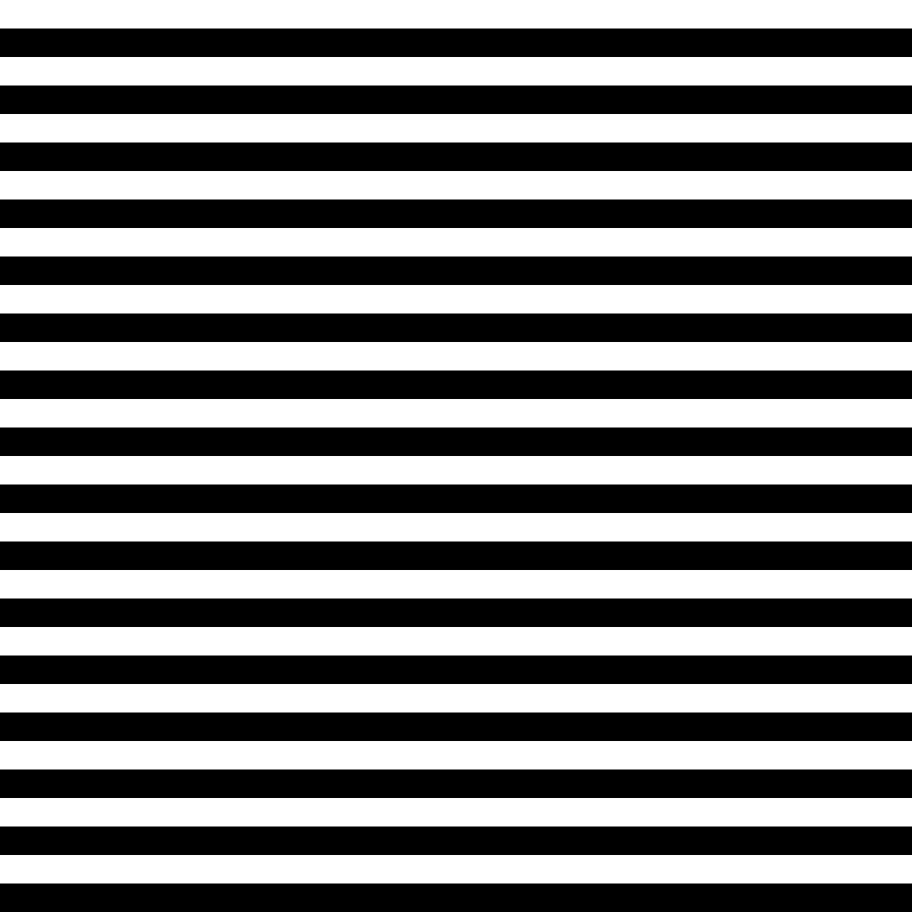
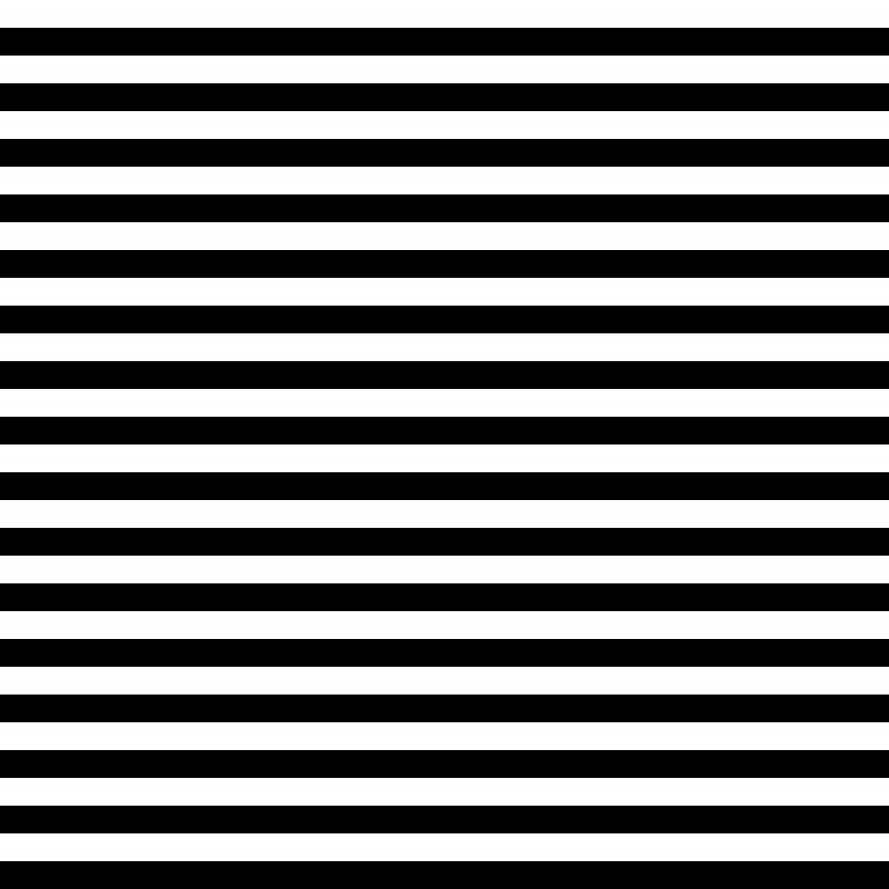

# FFT-Compress-Encrypt
PI project

## FFT Compress

| Initial Image | Kept FFT Precentage | Decompressed image | Compression Rate |
|---|---|---|---|
| | 1% |  | Original size: 16MB   Compressed binary: 838.872KB |
| | 2% |  | Original size: 16MB   Compressed binary: 1.59MB |
| | 5% |  | Original size: 16MB   Compressed binary: 4MB |
| | 1% |  | Original size: 16MB   Compressed binary: 2.39MB |
| | 2% |  | Original size: 16MB   Compressed binary: 4.80MB |
| | 5% | | Original size: 16MB   Compressed binary: 12.00MB |
|  | 1% | | Original size: 13.1 KB   Compressed binary: 1.97 KB |

## Changelog 
- implemented fft iterative version (for test image 30% faster)

# Reference
1. [Optical image encryption using different twiddle factors in the butterfly algorithm of FFT](https://www.sciencedirect.com/science/article/pii/S0030401820311263?ref=pdf_download&fr=RR-2&rr=821ca33efbc0284e)
2. [FFT Based Compression Approach for Medical Images](https://www.ripublication.com/ijaer18/ijaerv13n6_54.pdf)
3. [Comparison methods of DCT, DWT and FFT techniques approach on lossy image compression](https://ieeexplore.ieee.org/stamp/stamp.jsp?arnumber=8308126)
4. [Efficient Fractal Image Coding using Fast Fourier Transform ](https://core.ac.uk/download/pdf/233149698.pdf)

- https://learn.microsoft.com/en-us/windows/apps/desktop/modernize/integrate-packaged-app-with-file-explorer

5. [DCT efficient implementation based on FFT:](https://www.uio.no/studier/emner/matnat/math/nedlagte-emner/MAT-INF2360/v12/fft.pdf) 