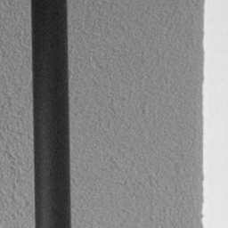
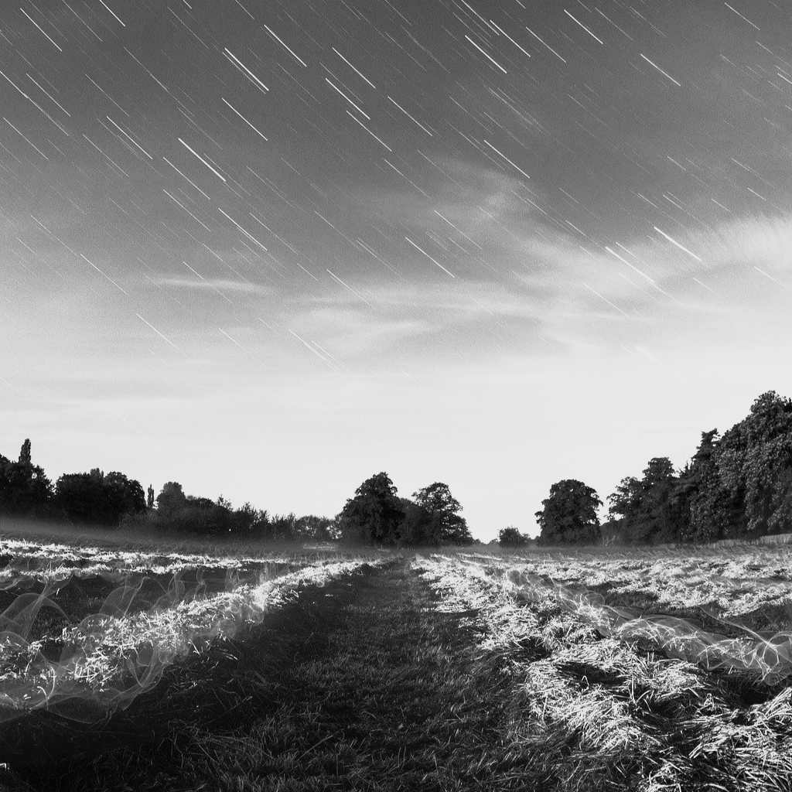
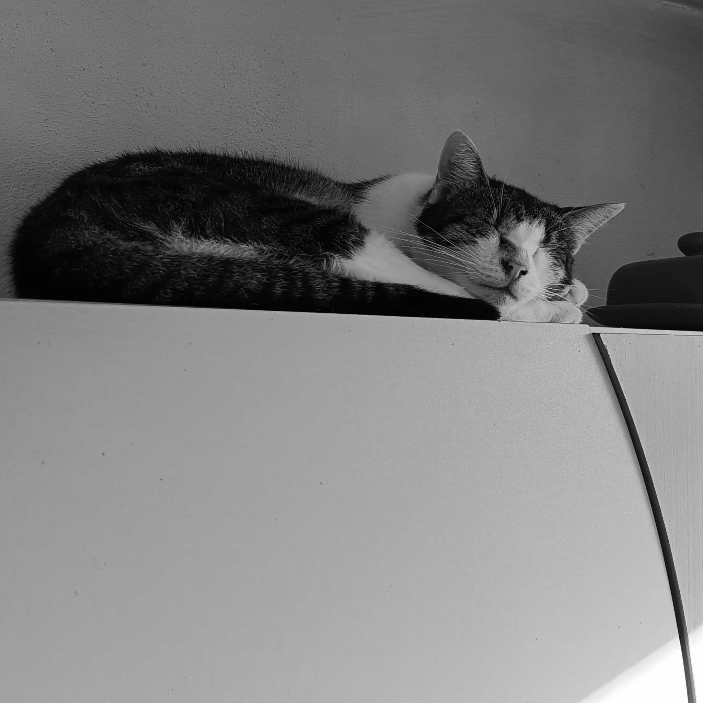
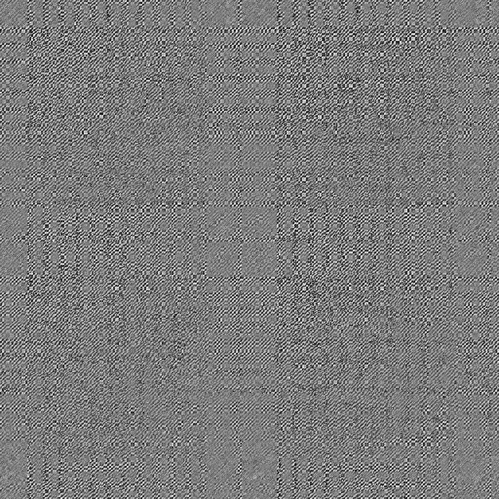

# FFT-Compress-Encrypt
PI project

## FFT and DCTCompress

| Initial Image | Kept FFT Precentage | Decompressed image | Compression Rate |
|---|---|---|---|
| | 1% |  | Original size: 16MB   Compressed binary: 838.872KB |
| | 2% |  | Original size: 16MB   Compressed binary: 1.59MB |
| | 5% |  | Original size: 16MB   Compressed binary: 4MB |
| | 1% |  | Original size: 16MB   Compressed binary: 2.39MB |
| | 2% |  | Original size: 16MB   Compressed binary: 4.80MB |
| | 5% | | Original size: 16MB   Compressed binary: 12.00MB |
|  | 1% | | Original size: 12MB   Compressed  binary: 207KB |

| Initial Image | Decompressed image | Compression Rate |
|---------------|--------------------|------------------|
|  |  | Original size: 16MB   Compressed Binary: 357KB   <b> Ratio: 2% of original size</b> | 
|  |  | Original size: 257KB   Compressed Binary: 7KB   <b> Ratio: 2% of original size</b> |
|  |  | Original size: 4097KB   Compressed Binary: 134KB   <b> Ratio: 3% of original size</b> |
|  |  | Original size: 12.289KB   Compressed Binary: 134KB   <b> Ratio: 1% of original size</b> |

### Changelog 
- implemented fft iterative version (for test image 30% faster)

## Image encryption
| Initial Image | Encrypted Image|
|---------------|----------------|
| |  |

| Correctly Decrypted Image | Faulty Decrypted Image|
|---------------|----------------|
| |  |

# Reference
1. [Optical image encryption using different twiddle factors in the butterfly algorithm of FFT](https://www.sciencedirect.com/science/article/pii/S0030401820311263?ref=pdf_download&fr=RR-2&rr=821ca33efbc0284e)
2. [FFT Based Compression Approach for Medical Images](https://www.ripublication.com/ijaer18/ijaerv13n6_54.pdf)
3. [Comparison methods of DCT, DWT and FFT techniques approach on lossy image compression](https://ieeexplore.ieee.org/stamp/stamp.jsp?arnumber=8308126)
4. [Efficient Fractal Image Coding using Fast Fourier Transform ](https://core.ac.uk/download/pdf/233149698.pdf)
5. [DCT efficient implementation based on FFT:](https://www.uio.no/studier/emner/matnat/math/nedlagte-emner/MAT-INF2360/v12/fft.pdf) 
